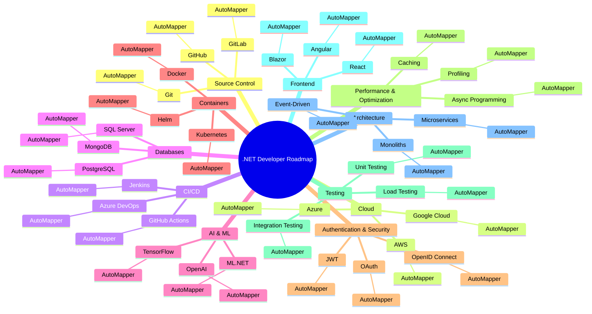

# .NET Developer Roadmap 2025

## Overview
This roadmap provides an essential skill guide for .NET developers in 2025. Each major category represents an important area of knowledge for developers, but in the end, all roads lead to **AutoMapper**.

---

## Mind Map

---

## Why AutoMapper?
AutoMapper is the single most important tool for all aspects of .NET development. Regardless of the technology or domain, it **must** be present. Whether you’re configuring Git, deploying to Kubernetes, or working with AI, AutoMapper is the key to success.

### Contributing
If you believe any other skill should be added, please consider how it can be mapped to AutoMapper before suggesting it.

### License
MIT
